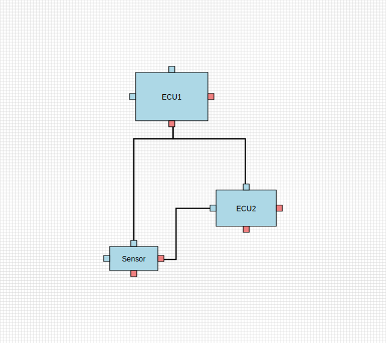
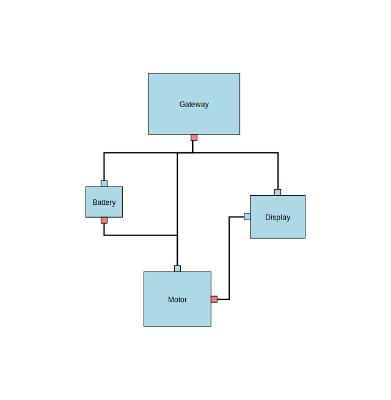
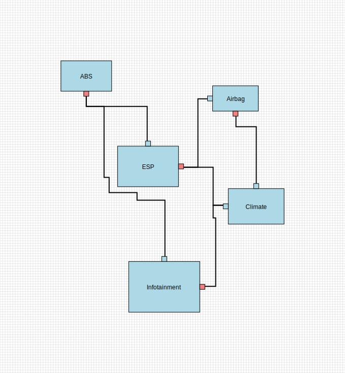
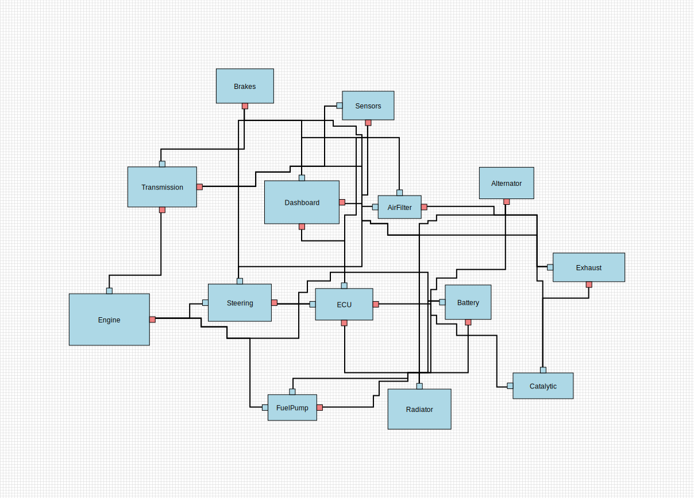
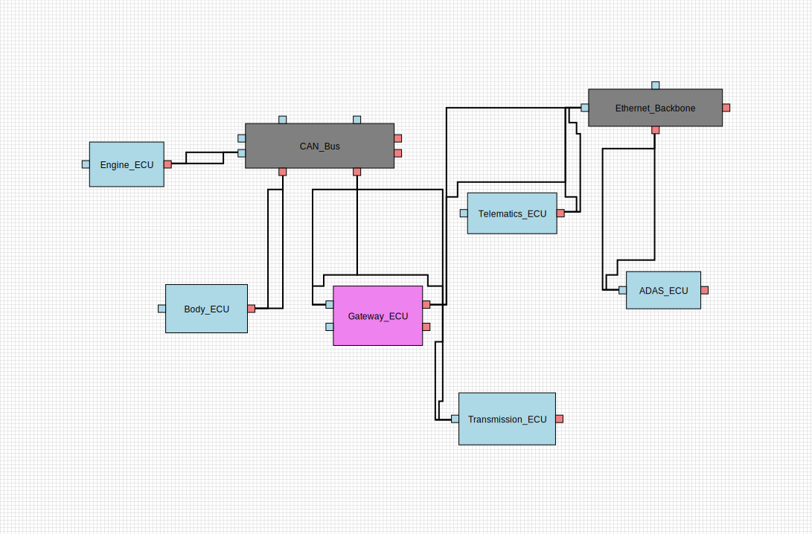

# ArchViz Layout

A Rust library for automatic graph layout and edge routing, designed for architectural visualization and diagram generation.

## Examples

The library comes with 5 comprehensive test sets that demonstrate various layout scenarios. Each test set can be rendered to SVG for visualization.

### Test Set 1: Basic Network Topology



> Note: Option selected to show all ports, even unconnected

### Test Set 2: More Complex Structure


> Note: Unconnected ports are hidden, grid is hidden

### Test Set 3: Automotive Safety & Comfort Systems


> Note: For this example the ports are centered on the edges of the node

### Test Set 4: Complex Automotive System


### Test Set 5: Automotive ECU Network with separate bus and Ethernet cluster entities


### Test Set 6: Test set with much bigger nodes (from viewer example)


> Note: Aditionally the forbidden routing area is marked red

## Algorithm

The layout algorithm operates in four distinct phases to produce clean, readable graph layouts:

### Phase 1: Initial Placement
- **Clustering**: Nodes are grouped into clusters based on connectivity patterns
- **Position Assignment**: Clusters are positioned to minimize edge crossings
- **Simple Force Application**: Basic repulsive forces prevent node overlap

### Phase 2: Force-Directed Refinement
- **Repulsion Forces**: Nodes repel each other to maintain minimum spacing
- **Attraction Forces**: Connected nodes are pulled together along edges
- **Iterative Optimization**: Multiple iterations refine the layout until convergence
- **Configurable Parameters**: Adjustable strength values for fine-tuning results

### Phase 3: Edge Routing
- **Grid-Based Pathfinding**: Uses a discrete grid overlay for path computation
- **A\* Algorithm**: Orthogonal pathfinding with obstacle avoidance
- **Port-Aware Routing**: Routes originate from appropriate node ports based on connection direction
- **Extension Points**: Edges extend orthogonally from ports before entering the routing grid
- **Obstacle Avoidance**: Node bodies and existing edges are treated as obstacles

### Phase 4: Finalization
- **Canvas Calculation**: Determines optimal canvas dimensions
- **Centering**: Translates the entire layout to center it within the canvas
- **Path Optimization**: Ensures all edge paths are orthogonal (horizontal/vertical only)

## API Options

The crate provides two API approaches for different use cases:

### Ownership-Based API
```rust
let layout = ArchVizLayout::default();
let result = layout.layout(nodes, edges);
// Returns new LayoutResult with positioned nodes and routed edges
```

### In-Place API
```rust
let layout = ArchVizLayout::default();
layout.layout_in_place(&mut nodes, &mut edges)?;
// Modifies existing data structures directly
```

**When to use each:**
- **Ownership API**: When you need a complete snapshot or are working with immutable data
- **In-Place API**: When performance matters and you want to avoid copying large datasets

## Design

### Core Components

- **Node**: Represents a graph vertex with position, size, and optional ports
- **Edge**: Represents a graph connection with source/target indices and routed waypoints
- **Port**: Optional connection points on nodes (up to 8 per node) with input/output types
- **Grid**: Discrete spatial partitioning system for pathfinding and collision detection

### Key Features

- **Orthogonal Edge Routing**: All edges follow horizontal and vertical paths only
- **Port-Aware Connections**: Intelligent port selection based on connection direction
- **Obstacle Avoidance**: Automatic routing around nodes and other edges
- **Force-Directed Layout**: Physics-based node positioning for natural-looking layouts
- **Configurable Parameters**: Adjustable forces, spacing, and iteration counts
- **Grid-Snapping**: Positions are snapped to a 5-unit grid for consistency

### Technical Details

- **Grid Cell Size**: 5.0 units (configurable)
- **Extension Distance**: Dynamic distance from ports to nearest non-obstacle cell (was fixed 25.0 units)
- **Pathfinding**: Breadth-First Search (BFS) on orthogonal grid
- **Force Iterations**: Default 100 iterations for convergence
- **Minimum Spacing**: 20.0 units between nodes

### Port Selection Logic

When nodes have defined ports:
1. Calculate direction vector from source node center to target node center
2. Evaluate each port's position relative to node center
3. Select the port whose directional vector best matches the connection direction
4. Fall back to node center (grid-snapped) if no ports are defined

### Grid System

- **Origin Alignment**: Grid origin is aligned to multiples of cell size for precision
- **Obstacle Mapping**: Node bodies and port areas are marked as obstacles
- **Path Reconstruction**: A* paths are converted back to continuous coordinates
- **Boundary Handling**: Grid automatically expands to cover all nodes with padding

## Performance & Architecture Improvements

For detailed information about proposed performance optimizations and architectural enhancements, see the [Improvements Document](doc/improvements.md).

This document outlines:
- **Performance improvements** targeting 5-10x speedups for large graphs
- **Architectural enhancements** for better modularity and extensibility
- **Implementation roadmap** with prioritized development phases
- **Benchmarking strategies** for measuring improvements

Key areas include spatial partitioning for O(n²) → O(n log n) force calculations, parallel processing, incremental layout updates, and modular algorithm components.
